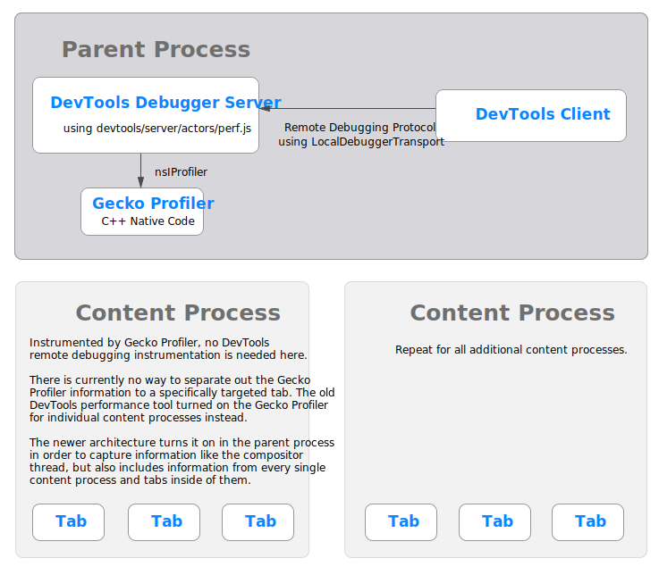

# Profiler Architecture

This document provides an overall look at the architecture of the profiler, and how all the various pieces fit together.

## Gecko Profiler

The Gecko Profiler has two interfaces: first interface is DevTools Server Actors and can be opened from new: devtools/server/actors/perf.js, old: devtools/server/actors/performance.js and the second interface can be accessed by installing a Web Extension via: browser.geckoProfiler. 
These interfaces are JavaScript front-end interfaces for the nsIProfiler service. The nsIProfiler is accessing the Gecko Profiler, a C++ Native Code component inside of Gecko.

## Browser

The Gecko Profiler Addon is using Private WebExtension API and with browser.geckoProfiler.start(), browser.geckoProfiler.stop(), browser.geckoProfiler.getProfiler() ... it accesses the Gecko Profiler, written in C++ Native Code. 
The Gecko Profiler Addon opens up a new window with perf.html. Then injects the JSON profile content via a content script. perf.html is an unprivileged webpage [https://perf-html.io]. Content Window is instrumented by Gecko Profiler.

## DevTools Recording Panel

Please note, this is the diagram for the new recording panel in DevTools that is off by default. This is the path forward for integrating perf.html into DevTools. It can be enabled using `devtools.performance.new-panel-enabled`. There is no architecture doc for the current Firefox DevTools panel.

Parent Process
DevTools Client is accessing the DevTools Debugger Server using [devtools/server/actors/perf.js] (remote Debugging Protocol using LocalDebuggerTransport). DevTools Debugger Server is accessing the Gecko Profiler, written in C++ Native Code using the nsIProfiler.

Content Process
Instrumented by Gecko Profiler, no DevTools remote debugging instrumentation is needed here. 
There is currently no way to separate out the Gecko Profiler information to a specifically targeted tab. The old DevTools performance tool turned on the Gecko Profiler for individual content processes instead.

The newer architecture turns it on in the parent process in order to capture information like the compositor thread, but also includes information from every single content process and tabs inside of them. 
Tab Tab Tab

Content Process
Repeat for all additional content processes.
Tab Tab Tab

## Remote Profiling

Remote profiling with DevTools is very similar to the above diagram, but involves slightly different transport messaging mechanisms in order to target remote devices.

WebIDE
DevTools Client, Remotely Talking to Phone, opens up a new window with perf.html (unprivileged webpage [https://perf-html.io]). Then injects the JSON profile content via a content script.
DevTools Remote Dubugging Protocol uses a remote target transport to communicate with the phone. 
Remote Target - Phone or Browser
DevTools Client is accessing DevTools Debugger Server using [devtools/server/actors/perf.js]. 
DevTools Debugger Server is accessing the Gecko Profiler, written in C++ Native Code, through nsIProfiler.

