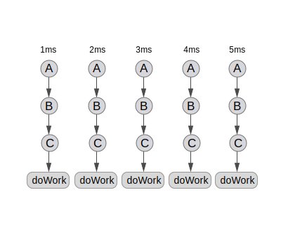
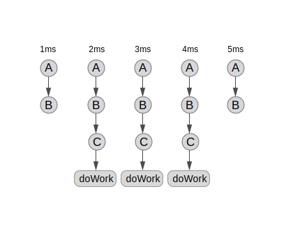

# Stack Samples and Call Trees

The [profiler fundamentals](./profiler-fundamentals) details information about both samples and markers. While samples can collect any type of arbitrary information, this document explores one core idea about samples—that they can collect stacks.

## Stacks gathered over time

These examples assume the profiler is configured to collect samples every 1 millisecond. As the targeted code runs, the profiler stops the program execution, and samples the stack. Often, the roots of the stacks will look very similar, but then the leaves will vary wildly as the code calls into different parts of the program. If a program is profiled for 3 seconds, at the rate of 1 millisecond per sample, then there would be 3000 samples. It is not practical to view samples individually, so these samples will be aggregated together to provide a more useful look into profile execution. This aggregated data structure is the call tree.

## A simplified call tree

This example creates a fairly contrived and simple example. `A` calls `B`, which calls `C`, then calls `doWork`. `A`, `B`, `C` are very quick to run, and the profiler never directly samples them. However, `doWork` is sampled 5 times. An aggregation of this profile would smush everything into one graph.

This graph is a simplified call tree. Notice that there is no branching, as the samples that are aggregated all share the same stacks. The profiler only samples the function `doWork`, but the rest of the stack is in the report. This means that the running time for every node on the call tree is 5ms. (From here on out a node on a call tree will be referred to as a "call node"). However, since only the `doWork` function was observed, it is the only node to have self time of 5ms, as it was itself observed to be running. `A`, `B`, `C` all have a self time of 0ms.

## Self time in the call tree

Self time does not actually need to be found at the leaves of the call tree. In fact it can be located at any node in the tree. Self time is where the profiler observed a function running. Imagine in the previous example that the function `B` also required a bit of time to run.

This image shows that the profiler sampled `B` at the beginning and end of the profiling. This will not change the shape of the call tree, but it will change the self and running times reported.

The call node with the function `B` continues to have the running time of 5ms, but also has a self time of 2ms. Function `C` has a reduced running time of `3ms` and finally do work was only observed `3ms` for both the running and self time.

In summary, self time is where work was actually happening when observed by the profiler.

## How to form a call tree

> Note: Feel free to follow along with a real call tree that reproduces this structure: [https://perfht.ml/2w45IdC](https://perfht.ml/2w45IdC)

The simple call tree above did not take into account any branching stacks. It only concerned itself with running and self time. This section will dive into how the call tree handles stacks of different shapes.

Consider the first 3 samples in this profile.

These three samples share things in common. The root of each stack is the function `A`. These could be aggregated together into a single node. The same happens for node `B`. However the next level with the function `C` and `H` differ. At this point the call tree splits into two different nodes. There is a node for the function `C`, and the function `H`.

The call tree will continue merging functions that are at the same level, but only if they are part of the current branching pattern. For instance, consider function `F` and `G`. While both functions are at the same level of the stack, they are at different branching points. The middle `F -> G` stacks have `C` as their ancestor, and the right `F -> G` stacks have `H` as their ancestor, and thus are not grouped together.

A useful exercise at this point would be to consider [the running time](../images/call-tree-running-time.svg) and [self time](../images/call-tree-self-time.svg) of each node this call tree.

# Referring to call nodes in the call tree

The above example shows how functions F and G can appear multiple times in a call tree, thus it's ambiguous to refer to a call node by only its function name. Call nodes can be referred to by their call node paths, which are composed of a list of functions from root to leaf. The middle `G` call node in the tree would have the call node path `A, B, C, F, G`, while the one on the right would have the call node path `A, B, H, F, G`.
